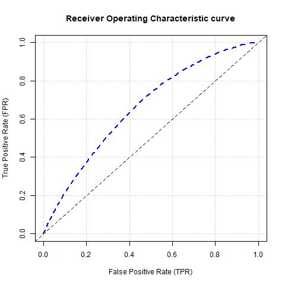

## Introduction

DNA is a helical three dimensional structure that encodes life through the transcription of deoxynucleotides into messenger RNA (mRNA), which is then used to create new biological structures (ie. translation into proteins). This is essentially the central dogma of biology. Regulatory elements upstream control when DNA should be transcribed, which means that they can control what inputs are provided for downstream physiological processes. Because of this, understanding the causes of upregulation and downregulation of gene transcription and the mechanisms behind them area an important part of understanding biology. 

In the cell, DNA can take on many shapes because of it's lifecycle and environment. During metaphase in the cell cycle, DNA is wound up tightly around simple protein structure called histones, which are then wound up into nucleosomes until the final product is reached: the aligned, diploid chromosomes attached at the centromere. While not replicating, DNA is more of a tangled web within the nucleus (strictly speaking for humans), which allows for it to be opened and transcribed. 

[TODO: need to flow into next paragraph better]

Thanks to on going efforts in next generation sequencing, new assays and techniques have developed recently that fall under the umbrella of 3 Dimensional Chromosome Conformation Capture (3C), which identify DNA coordinates that are near each other. This occurs by ligating (connecting) sequences together while they are within the cell with the goal of sequencing these connected DNA together. One particular 3C technology that has gained traction is Hic data, which allows for the use of next generation sequencing to get high fidelity reads of DNA that are close in space. 

Thanks to these technologies, researchers have learned DNA tends to have a programmed tangled structure that is cell type specific [TODO: source?]. Indeed, there are areas that tend to be more open that allow for transcription to occur and areas that are closed. These areas are known as topologically associating domains (TADs), and have shown to be the basin of biological processes. 

More research has occurred to understand TADs and what characterizes their boundaries. Conformation capture technology shows more contacts been DNA coordinates with a TAD than between coordinates that are in separate TADs, and therefore the boundaries implicitly define what relationship can occur. Thus, the relationships of genes (units of heredity) tend to be contained within tads as demarcated by the boundary [TODO: fix this sentence]. Transcription binding sites and start sites have shown to be more dense around these boundaries as well. Methylation of DNA also tends to be dense around these regions. There are various technologies that exist to capture these data and can provide more information about where TADs exist.

The current issue with 3C technology is that it is expensive. New efforts to identify TADs have been to train machine learning algorithms to predict TADs using epigenetic features that have also shown to be dense around these domains. A paper that recently came out showed success using a supervised boosted gradient machine algorithm to identify tads using various cell lines. The paper made use of preexisting data that is out in public databases, thus making it a viable option to reproduce their steps.

Our goal is to replicate work done in this field using pytorch and to see if we are able to modify the algorithm to increase accuracy. In doing so, we attempt to contribute to TAD prediction. 

## Results

[TODO: needs accurate numbers of final methylation set]

Our data was split into 70:30 training and test sets. In total, there were 212544 observations in the training set, and 91074 observations in the test set. There were 27 columns in our final data table for the methylation data. Each column represents a 10kb bin around the tad, and the amount of methylation occuring within that 10 kb bin. We would expect to see higher values in those bins if the coordinates assocatied with a tad are near the tad boundary.

With our gradient boosting machine algorithm, we were able to achieve roughly 77% accuracy with the test set. 

[TODO: ROC score here. there is a function from [scikit](https://scikit-learn.org/stable/modules/generated/sklearn.metrics.roc_curve.html)]

Again only using the methylation data, we ran using the gradient boosting model provided by H2o.ai [TODO: link], which was used by the researchers. We used their code in order to run this model, but removed the inputs for transcription factor, transcription start sites, histone sites, and distances to centromeres, as we did with our own data. We were able to run the script and achieved 88% accuracy. Below are ROC scores showing the performance of this model.

Figure X. Receiver Operating Characteristic curve using the GBM model from H2o.ai. The curve shows the true positive rate against the false positive rate.

## Discussion

We we're unable to outperform h2o.ai with their gradient boosting machine using the same dataset with our custom function.

[list some of the drawbacks here]

## Statement of Individual Contributions

Both authors worked on the assignment together but there were areas that mostly had dedicated attention from a single author.

A large portion of the data searching, gathering, preprocessing, and preparation was done by Brian. Essentially, this involved creating the inputs and outputs to be served to the model. This required reading and understanding the paper's methods, and determining where the data was located. One source were the [GEO ENCODE](https://www.ncbi.nlm.nih.gov/geo/query/acc.cgi) asscension numbers located in the data availability section. This is where many of the cell line specific matrixes were found. Additionally, the [3D Genome Browser](http://3dgenome.fsm.northwestern.edu/) was used to collect TAD boundaries, specifically used as the hard labeled data. Transcription binding sites were acquired from the [UCSC Genome Browser](https://genome.ucsc.edu/).

A large amount of headache was caused by the data gather step, particularly when using GEO. While there were 10 - 12 ascension numbers, the methods on which data to use or how to modify the data was difficult to determine. In the interest of time, we ultimately decided to use the data that was easier to find (ie. methylation and transcription binding sites), and adjust our project goals to use just that data. 

The preprocessing and data preparation steps were largely based on the scripts provided by the papers authors. The data for methylation was gathered from GEO ENCODE. P-values were included in the dataset, and so methylation values under p=0.05 were included. Finally, the average methylation score was taken for all valid scores that were within the 10kb range. Thus, all methylation and training and test data used significant methylation data average per 10 kb bin.

The transcription binding site data was gathered from the UCSC Genome Browser. Transcription binding sites for genes were found and overlapping sections were pulled out. Overlapping sections were of interest because this is where the binding sites are in greater density, which implicitly demarcates tad boundary sites. The average score was calculated by the number of overlapping binding sites within the 10 kb region. 

The final preparation step was to generate 10 kb neighbors for each feature. The neighbor generation allow extension of relationships between features for each tad boundary. Since these epigenetic features are known to be around TAD boundaries, this allows our TAD predictions to be more engrained in the larger epigentic picture.